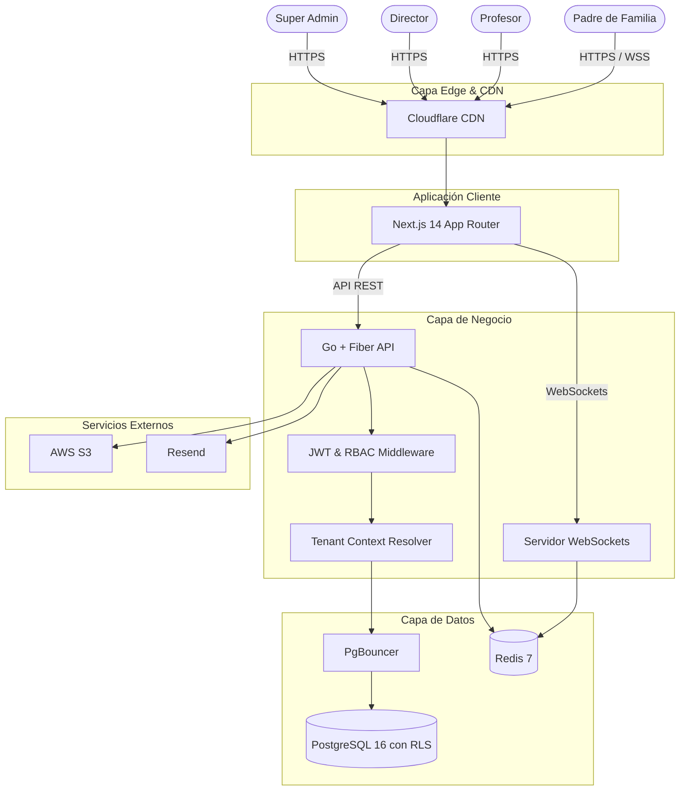

# 🚀 Arquitectura y MVP Actualizado: EduCore SaaS

## 🏗️ Recomendación de Stack Tecnológico (Máximo Rendimiento)

Para soportar miles de usuarios concurrentes con latencias casi instantáneas, la combinación ganadora es **Go + PostgreSQL**.

### 1. Backend: Go + Fiber (Recomendado sobre .NET)
- **Por qué Go:** Manejo nativo de concurrencia mediante *goroutines*. Consume una fracción de la RAM que usa .NET o Node.js. 
- **Rendimiento:** Tiempos de respuesta de sub-milisegundos y compilación a binario único. Ideal para APIs REST ultrarrápidas y WebSockets concurrentes.

### 2. Base de Datos: PostgreSQL 16 + PgBouncer (Recomendado sobre Firebase)
- **Por qué Postgres:** Firebase (NoSQL) complica enormemente el aislamiento de datos (Multi-tenancy). PostgreSQL permite **Row Level Security (RLS)**, garantizando a nivel de motor que una escuela jamás verá los datos de otra.
- **PgBouncer:** Obligatorio para manejar miles de conexiones simultáneas sin saturar la base de datos.

### 3. Frontend y Edge: Next.js 14 + Cloudflare
- **Por qué Next.js:** Renderizado híbrido (Server Components) para cargar la interfaz instantáneamente.
- **Cloudflare Edge:** Almacena en caché los assets y reduce la latencia física al usuario final.

### 4. Caché y Real-Time: Redis 7
- **Por qué Redis:** Almacenamiento en memoria para sesiones ultrarrápidas, *rate limiting* y Pub/Sub para emitir notificaciones en tiempo real a los padres.

---

## 🗺️ Mapa Conceptual de Arquitectura

---

## 📋 MVP Actualizado (4 Módulos)

### 1. Infraestructura de Alto Rendimiento, Auth y Multi-tenancy
- **Motor Multi-Tenant (PostgreSQL RLS):** Aislamiento absoluto de datos por subdominio (`escuela.educore.mx`).
- **Autenticación Ultrarrápida:** Tokens JWT (Access 15m / Refresh 7d) cacheados en Redis.
- **RBAC (Roles):** Super Admin, Director, Profesor, Padre.
- **Connection Pooling:** PgBouncer integrado para soportar +10,000 requests concurrentes.

### 2. Manager Maestro (Super Admin Panel)
- **Dashboard Global:** Métricas consolidadas en tiempo real.
- **Tenant Provisioning:** Creación instantánea de escuelas (esquema, director base) automatizado.
- **Feature Flags:** Control de módulos por escuela en milisegundos usando Redis.

### 3. Manager de Escuela + Núcleo Académico
- **Dashboard de Escuela:** Perfiles, configuraciones y ciclos escolares.
- **Gestión de Personal y Alumnado:** Carga rápida de expedientes.
- **Asistencias Bulk:** Los profesores registran 40 alumnos en 1 clic; proceso asíncrono con Redis + Go.
- **Calificaciones y Boletas:** Captura masiva y generación instantánea de PDFs vía `chromedp` en Go.

### 4. Portal de Padres (Móvil-First & Tiempo Real)
- **Dashboard Multi-hijos:** Vista unificada sin tiempos de recarga.
- **WebSockets / Notificaciones Push:** El padre recibe una alerta instantánea si el alumno es marcado como ausente o si se publica una calificación.
- **PWA Ready:** Instalable en iOS/Android nativo para acceso directo.
